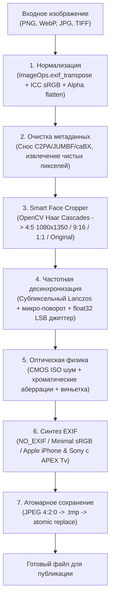

# 📸 Reelsator — Instagram AI Photo Optimizer & Provenance Sanitizer

[](https://www.python.org/)
[](https://microsoft.com/windows)
[-41CD52.svg)](https://qt.io/)
[]()
[](https://github.com/csezet/reelsator/actions/workflows/test.yml)
[](LICENSE)

**Reelsator** — высокопроизводительный инструмент для предпубликационной подготовки ИИ-сгенерированных изображений (ChatGPT Image, DALL-E, Midjourney, Stable Diffusion, Flux) под требования Instagram.

Программа выполняет комплексную очистку манифестов происхождения (C2PA / JUMBF / XMP), нормализацию цветовых профилей (Display-P3 $\to$ sRGB) и EXIF Orientation, кадрирование под стандарты Instagram, физическую симуляцию шумов сенсора камеры и инъекцию валидных структур EXIF мобильных камер (Apple iPhone 15/16 Pro).

---

## 🔍 Инженерные задачи подготовки контента

1. **Санитизация метаданных C2PA и промптов**: Генераторы встраивают в JPEG (APP11/JUMBF) и PNG (`caBX`, `c2pa`, `tEXt`) сертификаты происхождения и текстовые промпты. Reelsator декодирует изображение в чистый пиксельный буфер с полной отсечкой метаданных, а также предоставляет побайтовый парсер для удаления сегментов на уровне контейнера.
2. **Управление цветом (Color Management)**: Приведение изображений из широких цветовых пространств (Display-P3, AdobeRGB) к стандартному sRGB через ICC-профилирование предотвращает искажение оттенков кожи.
3. **Нормализация EXIF Orientation**: Автоматический учет ориентации кадра перед очисткой контейнера исключает переворот вертикальных фото.
4. **Безопасная обработка прозрачности**: Автоматический композитинг альфа-канала PNG/WebP на нейтральный белый фон для предотвращения черных артефактов в JPEG.
5. **Физика оптики и сенсора (Sensor Grain & Optics)**: Устранение чрезмерной «пластиковой» гладкости диффузионных генераций за счет адаптивного пуассоновского шума, оптических микро-аберраций и виньетирования.
6. **Синтез EXIF мобильных камер**: Генерация синтаксически валидного профиля Apple iPhone с математически согласованными параметрами выдержки по стандарту APEX ($Tv = \log_2(1 / t)$).
7. **Атомарная запись**: Сохранение через временные файлы (`.tmp`) с последующим атомарным замещением (`os.replace`) защищает от битых файлов при прерываниях.

---

## 🛠️ Архитектура Pipeline



### Модули ядра (`core/`):
* **`core/c2pa_killer.py`**: Побайтовый парсер JPEG и PNG. Удаляет JUMBF/C2PA, IPTC `trainedAlgorithmicMedia`, XMP и текстовые промпты. Выполняет ICC-трансформацию цвета в sRGB и безопасный композитинг альфа-канала (включая индексированные палитровые PNG `mode P` с чанком `tRNS`) на нейтральный белый фон.
* **`core/smart_cropper.py`**: Интеллектуальное кадрирование по правилу третей с детекцией лиц через OpenCV Haar Cascades под форматы Instagram (**4:5 1080 × 1350 px**, 1:1, 9:16) либо сохранение исходного разрешения. Выполняется до оптической обработки, предотвращая избыточное выделение оперативной памяти на исходных сверхвысоких разрешениях (50+ MP).
* **`core/watermark_disruptor.py`**: Субпиксельный ресэмплинг Lanczos, микро-поворот и субперцептивное возмущение младших бит (`float32`) для разрушения латентных периодических решеток.
* **`core/camera_optics.py`**:
  * **Шум сенсора (ISO Grain)**: адаптивная маска освещенности (зернистость выражена в тенях и полутонах, чистые света).
  * **Хроматические аберрации**: радиальный микро-сдвиг R/B каналов к краям кадра.
  * **Оптическая виньетка**: плавное падение освещенности к углам кадра ($cos^4$).
  * **Тональная калибровка Photonic Engine**: оптимизация контраста и теплоты тонов кожи.
* **`core/exif_spoofer.py`**: Управление структурами EXIF:
  * `NO_EXIF`: Полное отсутствие сегмента EXIF APP1 (чистый файл без метаданных съемки).
  * `MINIMAL`: Чистый технический профиль sRGB без фейковых дат и без идентификаторов софта.
  * `SYNTHETIC_CAMERA`: Синтез профилей реальных камер (iPhone 15 Pro, iPhone 16 Pro Max, Sony Alpha) с вычислением APEX ShutterSpeedValue ($Tv = \log_2(1 / t)$).
* **`core/pipeline.py`**: Пакетная очередь с безопасным созданием папок, защитой от перезаписи файлов (`resolve_unique_output_path`), кооперативной отменой и гарантией изоляции очереди.

---

## ⚡ Пресеты обработки

| Пресет | Назначение | Особенности |
|---|---|---|
| **OFM Master** *(Рекомендуемый)* | Основной сбалансированный профиль | iPhone 15 Pro, умный кроп 4:5, натуральное зерно сенсора |
| **ISP & Bayer Texture** | Текстурирование матрицы сенсора | Матрица Байера CFA, микро-контраст ISP, подавление пластикового вида |
| **iPhone Natural** | Портреты крупным планом, дневные фото | Минимальное вмешательство, iPhone 16 Pro Max, чистый цвет |
| **Story / Reels** | Истории и вертикальные публикации | Кадрирование 9:16 (1080 × 1920 px) |
| **Strong Processing** | Глубокая оптическая обработка | Усиленное частотное возмущение, выраженная оптика |
| **Original Resolution** | Без изменения геометрии кадра | Сохраняет исходное пиксельное разрешение изображения |

---

## ⚠️ Важное примечание о детекции и водяных знаках

* **Метаданные C2PA и манифесты**: Reelsator удаляет поддерживаемые контейнерные структуры JUMBF/caBX/XMP, проверенные unit/integration fixtures (включая эталонные подписанные манифесты Content Authenticity Initiative). Для разных реализаций Content Credentials рекомендуется независимая проверка результата внешним C2PA validator.
* **Невидимые водяные знаки (SynthID и др.)**: Системы невидимой маркировки (например, Google SynthID) математически проектируются для сохранения устойчивости к масштабированию, сжатию и шумам. Reelsator вносит субпиксельные геометрические и частотные возмущения, однако ни одно программное средство не может гарантировать 100% удаление всех типов латентных меток без существенной деградации видимого изображения.

---

## 🚀 Установка и запуск

### Требования:
* Python 3.10+
* Windows 10 / 11

### Установка для разработки (Development):
```bash
git clone https://github.com/csezet/reelsator.git
cd reelsator
pip install -r requirements.txt
```

### Воспроизводимая сборка (Reproducible Lockfile Install):
```bash
# Точно зафиксированные версии зависимостей
pip install -r requirements-lock.txt
```

### Запуск приложения:
```bash
python app.py
```

### Запуск тестов:
```bash
python -m unittest discover tests -v
```

### Сборка автономного .exe:
```bash
pip install -r requirements-lock.txt
pip install -r requirements-dev-lock.txt
python build_exe.py
```
Собранный дистрибутив размещается в папке `dist/Reelsator/Reelsator.exe`. Автоматическая проверка сборки выполняется в GitHub Actions (`.github/workflows/test.yml`).

---

## 📄 Лицензия
MIT License.
Автор: [csezet](https://github.com/csezet)
