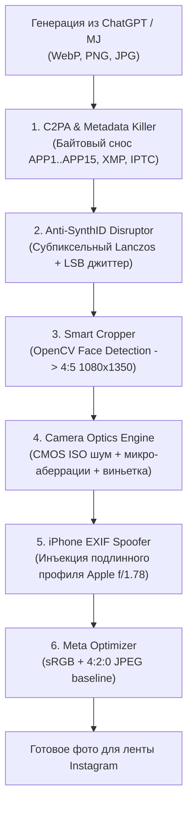

# 📸 Reelsator — Instagram AI Photo Cleaner & Anti-Detection Pipeline

[](https://www.python.org/)
[](https://microsoft.com/windows)
[-41CD52.svg)](https://qt.io/)
[]()
[]()
[](LICENSE)

**Reelsator** — профессиональный инструмент для подготовки ИИ-сгенерированных фотографий (ChatGPT Image 2.5, DALL-E 3, Midjourney, Stable Diffusion, Flux) к публикации в Instagram.

Программа нейтрализует алгоритмы детекции Meta, предотвращает появление плашки **«Информация от ИИ» («Made with AI»)**, спасает от теневого среза охватов (shadowban) и преобразует синтетическое изображение в неотличимый от оригинала снимок на **Apple iPhone 15 Pro / 16 Pro Max**.

---

## 🔍 Почему Instagram режет охваты ИИ-фото?

1. **Криптографические C2PA-манифесты**: ChatGPT и генераторы внедряют в JPEG (APP11/JUMBF) и PNG скрытые сертификаты происхождения. Instagram (член альянса C2PA) автоматически считывает их и мгновенно вешает плашку «Информация от ИИ», вырезая пост из ленты рекомендаций (Explore / Reels).
2. **Невидимые водяные знаки (SynthID / Stego)**: Закодированы в частотный спектр пикселей (DCT-коэффициенты) и вычисляются нейросетями Meta.
3. **Ловушка пустого EXIF**: Обычное стирание метаданных оставляет файл с 0 байт EXIF. Instagram моментально определяет, что файл скачан из интернета или редактора, и отправляет его на углубленную проверку зрением Meta Vision.
4. **«Пластиковая» кожа и отсутствие физики оптики**: В генерациях отсутствует естественный пуассоновский шум фотонов (PRNU), микро-аберрации линз и виньетирование, присущие реальным смартфонам.
5. **Серверный компрессор Meta**: Загрузка фото не в пропорциях **4:5 (1080×1350 px)** или с большим весом приводит к жесткому пережатию серверами Instagram, что превращает микротекстуры в мыло.

---

## 🛠️ Архитектура и технологии OFM Pipeline



### Модули ядра (`core/`):
* **`core/c2pa_killer.py`**: Побайтовый парсер сегментов JPEG и чанков PNG. Уничтожает JUMBF/C2PA, IPTC теги `trainedAlgorithmicMedia`, XMP-блоки и комментарии без повреждения картинки.
* **`core/watermark_disruptor.py`**: Разрушает частотную сетку водяных знаков через микро-поворот (0.05°), субпиксельный сдвиг Lanczos (99.7%) и субперцептивный шум младших бит.
* **`core/camera_optics.py`**:
  * **Шум сенсора (ISO Grain)** с адаптивной маской яркости (в тенях и полутонах зернистость выше, в ярких бликах — чистый свет, как на матрицах Sony и iPhone).
  * **Хроматические аберрации**: радиальный сдвиг R/B каналов к краям кадра (имитация стеклянных линз смартфона).
  * **Оптическая виньетка**: 1.5–3% естественного затемнения углов.
  * **Тональная кривая Apple Photonic Engine**: легкая S-образная калибровка контраста и теплоты кожи.
* **`core/smart_cropper.py`**: Автоматическое обнаружение лица (OpenCV Haar Cascades) и кадрирование по правилу третей в формат **4:5 (1080 × 1350 px)**, 1:1 или 9:16.
* **`core/exif_spoofer.py`**: Синтезирует легитимный набор метаданных Apple iPhone (iPhone 15 Pro / 16 Pro Max, iOS 17.7 / 18.2, диафрагма f/1.78, выдержка, ISO, фокусное 24 мм, актуальные таймстампы).
* **`core/insta_optimizer.py`**: Финальный экспорт с субдискретизацией 4:2:0 и сжатием ~90%, не вызывающим повторного пережатия компрессором Instagram.
* **`core/pipeline.py`**: Пакетный менеджер очереди для мгновенной обработки десятков фото.

---

## ⚡ Пресеты обработки

| Пресет | Назначение | Особенности |
|---|---|---|
| **OFM Master** *(Рекомендуемый)* | Основной пресет для AI-моделей и ленты | Полный обход, iPhone 15 Pro, умный кроп 4:5, сбалансированное зерно |
| **iPhone Natural** | Селфи крупным планом, дневные фото | Мягкая обработка, iPhone 16 Pro Max, минимальный шум |
| **Aggressive Bypass** | Сложные генерации с жесткими метками | Усиленное частотное возмущение, выраженная оптика |
| **Story / Reels** | Истории и вертикальные рилсы | Пропорции 9:16 (1080 × 1920 px) |

---

## 🚀 Установка и запуск

### Требования:
* Python 3.10 или новее
* Windows 10 / 11

### Установка зависимостей:
```bash
git clone https://github.com/csezet/reelsator.git
cd reelsator
pip install -r requirements.txt
```

### Запуск тестов:
```bash
python -m unittest discover tests
```

---

## 📄 Лицензия
MIT License. Создано для авторов контента, исследователей медиабезопасности и SMM-специалистов.
Автор: [csezet](https://github.com/csezet)
